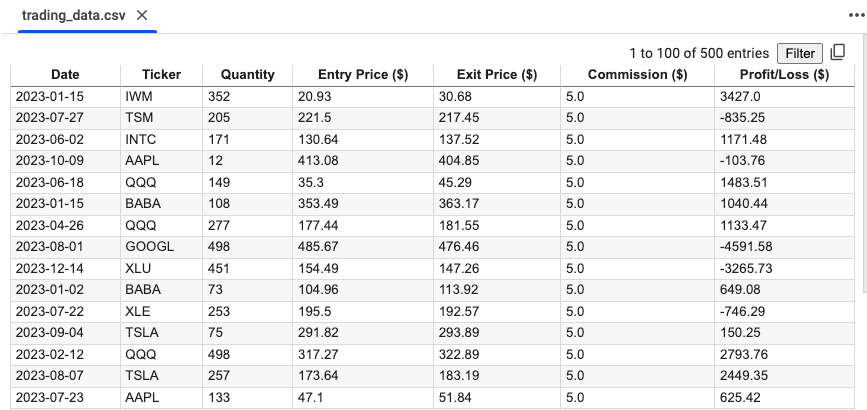
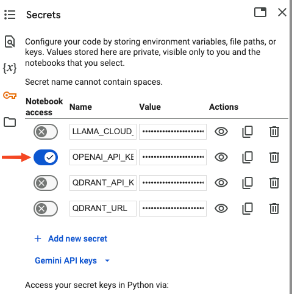

# AI-Powered Trading Journal

This project aims to provide trades with insights based on their trading journal. By uploading trading journal data in CSV format, natural language questions can be asked to gain detailed insights into trades.

## Features
- **Trading Data Integration**: Loads CSV trading journal data into an SQLite database using Pandas and SQLAlchemy
- **SQL Querying with AI**: Utilizes Langchain and GPT-4 for automated SQL query generation to extract insights from the trading data

## Dataset

The example dataset data can be replaced with custom trading journal data in CSV.

## Architecture

Will be added soon

## Usage

1. Open the Colab Notebook
   -  Open the provided [Colab notebook](https://colab.research.google.com/drive/1HzkuHjTfmh5YFTgENXUvUeejjWLBAXKJ?usp=sharing)

3. Upload the Trading Data
   - Upload the CSV file containing the trading journal data using the file uploader in the notebook, or just use the [example data](data/trading_data.csv) provided

3. Set Up API Keys:
   - Ensure that the OpenAI API key is added to the Colab environment

    

4. Run the Cells

## Contributing
Contributions are welcome! Please fork the repository and submit a pull request for any improvements or bug fixes.

## License
This project is licensed under the MIT License. See the [LICENSE](LICENSE) file for details.

## Contact
For questions or feedback, please contact me on [LinkedIn](https://www.linkedin.com/in/oktay-bogazkaya/)

